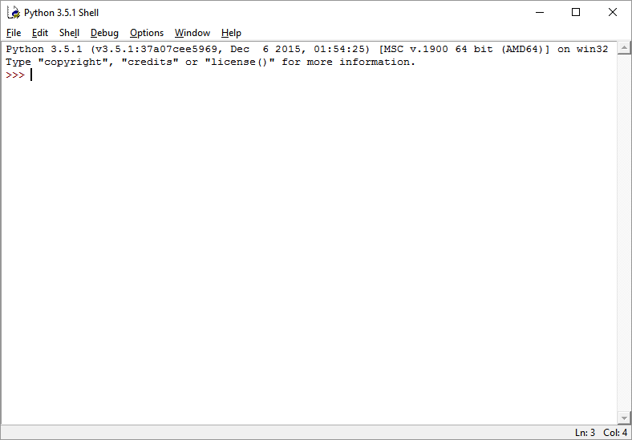

Python programma's zijn bestanden. Over het algemeen wordt voor Python
bestanden de extensie `.py` gebruikt.

De meeste Python installaties (in ieder geval die voor Windows en Mac
OS) installeren ook een omgeving om programma's in te schrijven, IDLE
geheten. Ze zetten ook een icoon op het scherm en/of een optie in een
start/programmamenu dat IDLE start. IDLE is nogal kaal, maar een
geschikte omgeving om in te programmeren.

{:width="70%" data-caption="De Python shell in IDLE."}

Als je IDLE start, ben je in een zogeheten "Python shell" (zie
afbeelding
<a href="#f:IDLE" data-reference-type="ref" data-reference="f:IDLE">3.1</a>)
Dit is, als het ware, een interactief Python programma, waarin je regels
code kunt typen die onmiddellijk worden uitgevoerd als je op `Enter`
drukt. Bijvoorbeeld, als je `print(7/4)` typt, geeft IDLE meteen als
antwoord $1.75$. Dit is niet de manier waarop je wilt programmeren, maar
je kunt wel op deze wijze snel het effect testen van regels Python code.

Om programma's met IDLE te creëren, kun je nieuwe Python bestanden
aanmaken, of bestaande Python bestanden openen, via het "File" menu.
IDLE geeft je dan een nieuw window waarin je code kunt schrijven,
aanpassen, en opslaan. Je kunt zelfs code laten uitvoeren in dit window
via het "Run" menu (er is ook een toets die je daarvoor kunt gebruiken,
meestal `F5`). Het programma wordt dan uitgevoerd in de "Python shell,"
dus daar kun je dan input ingeven en output zien. Zorg ervoor dat je als
bestandsnaam voor je programma's altijd iets kiest met de extensie
`.py`.

Er zijn meer gebruikersvriendelijke manieren om Python programma's te
schrijven. Je hebt dan een "tekst editor" nodig, bij voorkeur een editor
die specifiek Python ondersteunt. Merk op dat een tekst editor niet
hetzelfde is als een word processor (tekstverwerker); een tekst editor
heeft geen manieren om tekst te formatteren. Als je code in een tekst
editor typt, kan het zijn dat je wel formattering ziet, zoals
vetgedrukte woorden en gekleurde woorden, maar dit is "syntax
highlighting," een techniek die je laat zien dat je bepaalde
programmeertaal elementen aan het schrijven bent.

Er zijn veel tekst editors beschikbaar die Python ondersteunen, voor
verschillende besturingssystemen. Vele zijn gratis verkrijgbaar. Als je
IDLE niet prettig vindt werken, kun je een alternatief vinden op
Internet. Alle tekst editors hebben hun eigen voor- en nadelen, dus wat
je prefereert mag je zelf uitmaken.

