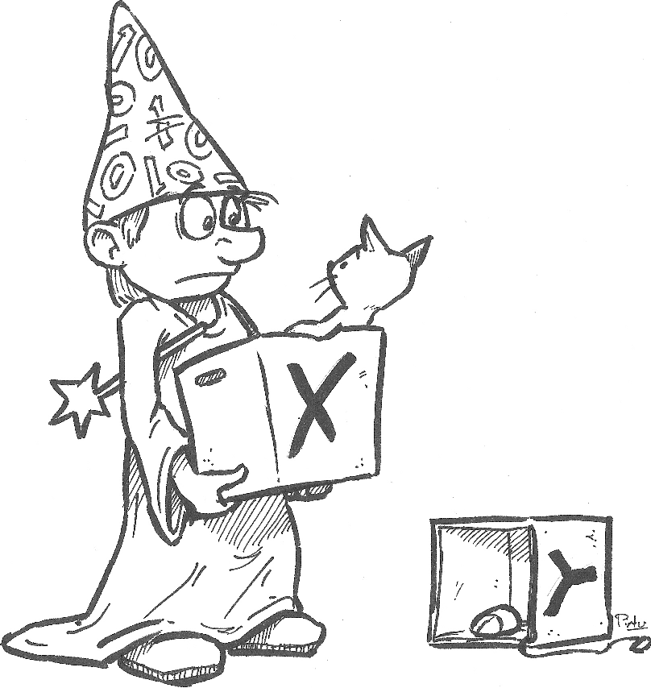

A variable is a labeled place in the computer memory that you can use to store a value in. The label you can choose yourself, and is usually called the "variable name".

To create a variable (i.e., choose the variable name), you must "assign" it a value. The assign-operator is the equals (`=`) symbol. To the left of it you put the variable name, and to the right of it you put the value that you want to store in the variable. This is best illustrated with an example:

```python
x = 5
print( x )
```

In the code block above, two things happen. First, I create a variable with the name `x` and give it a value, in this case 5. This is called an "assignment". I then display the contents of the variable `x`, using `print()`. Note that `print( x )` does not display the letter `x`, but actually displays the value that was assigned to `x`.

The variable `x` behaves pretty much like a box on which you write an`x` with a thick, black marker to be able to find it later. You can put something in the box, and then look into the box to see what you put in (though only one thing at a time will fit in the box). You can refer to the contents of the box by using the name written on the box. The term "variable" means the variable name, i.e., the letter `x` on the box. The term "value" means the value that is stored in the variable, i.e., the contents of the box.

{:data-caption="A variable behaves pretty much like a box on which you write a name with a thick, black marker to be able to find it later. You can put something in the box, and then look into the box to see what you put in (though only one thing at a time will fit in the box). You can refer to the contents of the box by using the name written on the box."}{ :width="50%"}


To the right of the assign operator you can place anything that results in a value. Therefore, it does not need to be a single number. It can be, for instance, a calculation, a string, or a call to a function that results in a value (such as the `int()` function).

<div class="callout callout-info">
  <h4>Exercise</h4>
  <p>In the previous chapter you wrote a calculation that determines the number of seconds in a week. Copy this calculation into a program, and assign it to a variable. Then add a statement to print the contents of the variable.</p>
</div>

When you assign a value to a variable name in your program, the first time you do that for a specific variable name, it creates the variable. If later in the program you assign another value to the same variable name, it "overwrites" the previous value. In the box metaphor: you empty the box and put something else in it. A variable always holds the value that was last assigned to it.

```python
x = 5
print( x )
x = 7 * 9 + 13   # overwrite the previous value of x
print( x )
x = "A nod's as good as a wink to a blind bat."
print( x )
x = int( 15 / 4 ) - 27
print( x )
```

Once a variable is created (and thus has a value), you can use it in your code where you otherwise would use values. You can, for instance, use it in calculations.

```python
x = 2
y = 3
print( "x =", x )
print( "y =", y )
print( "x * y =", x * y )
print( "x + y =", x + y )
```

You may copy the contents from one variable to another, using the assignment operator.

```python
x = 2
y = 3
print( "x =", x, "and y =", y )

# Swap the values of x and y using z as intermediary storage.
z = x
x = y
y = z
print( "x =", x, "and y =", y )
```

When you assign something to a variable, you might even use the variable itself on the right-hand side of the assignment operator, provided it was created earlier. The right-hand side of an assignment is always evaluated completely before the actual assignment takes place.

```python
x = 2
print( x )
x = x + 3
print( x )
```

Note that a variable must be created before you can use it! Running the following code will result in an error, because `days_in_a_year` has not (yet) been created before I use it on the first line:

```python
print( days_in_a_year )
days_in_a_year = 365
```